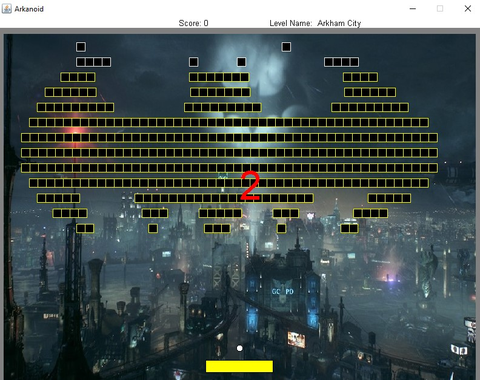
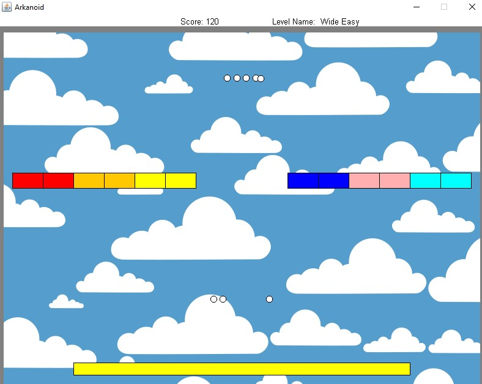

# Arkanoid
Final product of a 5-part-semester project in Java. This project was coded as a five-part ongoing assignment on the 2nd semester of my 1st year at `Bar Ilan University`. 
This project was coded using a single thread, which is rare for games such as this. Also, it uses no Java GUI Built-In objects, instead, I used a GUI implementation which is included in this repository.

# Creating and Editing Levels
This is a special arkanoid game: In order to add or edit levels in the game, you don't have to learn to code! Inside the `Arkanoid/resources/definitions` you will find simple txt files. The `level_definition.txt` file defines each level's charateristics in the game. By writing in this file you can edit the design of the game. Without coding, you can change anything from the name of the level, the images, the number of balls, the velocities, the blocks, etc.

In addition, each level has its own file in which you can further personalize the blocks desing of each level separately.

The game is made in a way that is able to read the txt file, and change the code according to that!

# Compiling and Running

You must have Java SE 10 or higher installed on your machine. 
You can download the entire source code and run the game via any Java IDEA, if you do be sure to also download the provided *biuoop-1.4.jar* (located [here](./biuoop-1.4.jar)).
Compiling the code should work using the command:

`ant compile`

and running it is with (should run also without args):

`ant -Dargs="path_to_level_file" run`

*(if the level file is not found - the [default levels](./resources/Default_Levels.txt) file will be played. If the background image file is not found, the default background clean white).*

